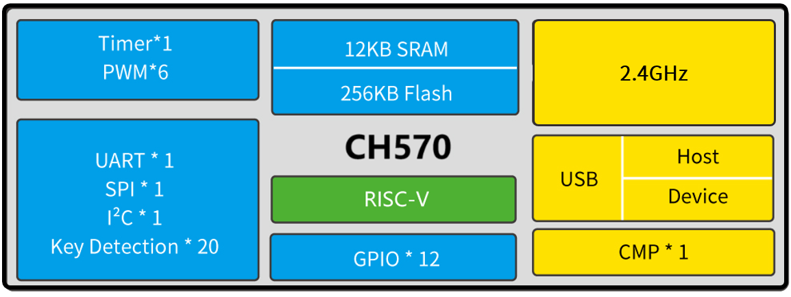
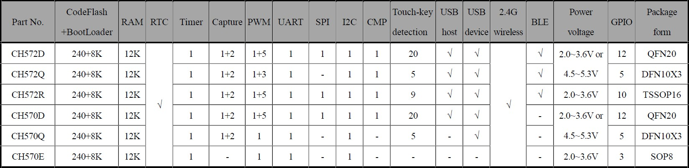

# RISC-V 2.4GHz Wireless & USB2.0 SoC - CH570
___
***CH570 is the world’s cheapest RISC-V 2.4GHz wireless & USB2.0 SoC, costing just about a dime (10 cents)!***
___

### Overview

CH570 is a RISC-V MCU microcontroller with integrated 2.4G wireless communication. It integrates USB full-speed controller and transceiver, voltage comparator CMP, key detection module, SPI, UART, I2C and other rich peripheral resources. CH570 has a built-in LDO5V voltage regulator to generate 3.3V, supports single 3.3V or single 5V power supply.

### System Block Diagram

### Features

 - QingKe RISC processor: RISC-V3C
 
 - Support RV32IMBC instruction set and self-extended instructions
 
 - 12KB SRAM, 256KB Flash
 
 - Support ICP, ISP and IAP, support OTA wireless upgrade
 
 - Built-in 5V to 3.3V voltage regulator LDO5V
 
 - Integrated with 2.4GHz RF transceiver and baseband and link control
 
 - Support 2Mbps, 1Mbps
 
 - Receiving sensitivity -95dBm, programmable +7.5dBm transmission power.
 
 - Provide optimized protocol stack and application layer API
 
 - Support up to 8kHz polling rate in 2.4G mode
 
 - Supports 20 channels of button detection, including 10 channels of matrix area buttons and 10 channels of independent area buttons
 
 - Built-in RTC, supports timing and trigger modes
 
 - Built-in full-speed USB2.0 controller and transceiver, support host and device mode at full/low speed
 
 - Built-in analog voltage comparator CMP, 16-level reference voltage, equivalent to 4-bit ADC
 
 - Provide 1 UART, 6-channel PWM, 1 SPI, and 1 I2C
 
 - 12 GPIOs, 1 of them support 5V signal input
 
 - AES-128 encryption and decryption, unique chip ID

 - Package: QFN20, TSSOP16, DFN10X3, SOP8

 ### Product Selection Guide

Compared with CH570, CH572 supports BLE 5.0. The BLE role can only be initialized as a broadcaster or a peripheral.